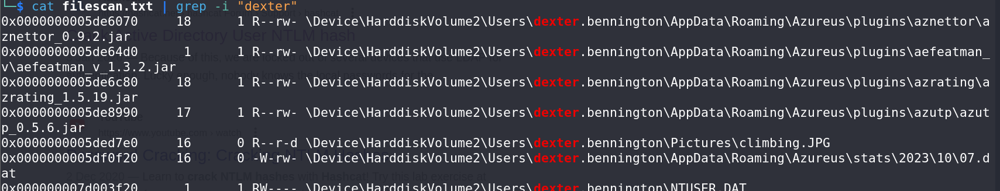
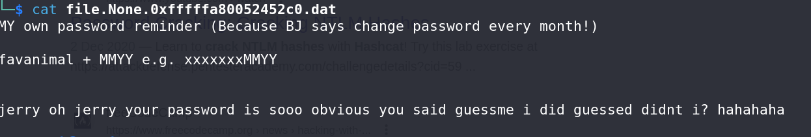

# Unearth the Long Lost Cipher - CTF Challenge Writeup

Challenge: Unearth the Long Lost Cipher
Points: 150
Category: Memory Forensics

## Objective
The objective of the "Unearth the Long Lost Cipher" challenge is to perform memory forensics to find Dexter's password on a computer. Your task is to uncover Dexter's password, which is hidden within the memory dump, and reveal the hidden flag.

## Solution
To successfully complete the "Unearth the Long Lost Cipher" challenge, follow these steps:

1. **Prerequisite - Complete m3m0irs**:
   - This challenge is the second in the memory forensics series and recommends completing the "m3m0irs" challenge as a prerequisite. However, since CTF has ended, it's not necessary to have completed it to proceed.

2. **Password Search**:
   - Your mission is to find Dexter's password on the computer. Passwords can be discovered in various ways during memory forensics, such as examining hash dumps or LSA dumps.

3. **Exploring Hash Dumps**:
   - I attempted to crack the hashes found in the memory dump to retrieve Dexter's password, but it did not work. 

4. **File Scanning**:
   - To find a potential lead, scan the files present in the memory dump. You can use the following command: `volatility -f <memory file> --profile=<architecture> filescan > filescan.txt`.

5. **Discovering SECRET.txt**:
   - After the file scan and looking for Dexter's files, you may come across a file named `SECRET.txt`. This file is of interest, as it might contain clues about Dexter's password.

6. **File Extraction**:
   - Extract the `SECRET.txt` file from the memory dump using the `volatility` tool. Copy the address of the `SECRET.txt` file and use the following command: `volatility -f <memory file> --profile=<architecture> dumpfiles -Q <memory-location> -D <directory-where-you-wish-to-place-the-file>`.

7. **Password Clues**:
   - Inside the `SECRET.txt` file, you may find clues about Dexter's password. It appears that Dexter constructed his password using his favorite animal and a mysterious MMYY.

1. **OSINT (Open Source Intelligence)**:
   - At this point, its basically OSINT, gather information about Dexter, his favorite animal, and the "MMYY" element.

2. **Flag Discovery**:
   - Search through the files related to Dexter's preferences and extract any relevant information. HINT: Flag shouild follow the format specified: a 7-letter animal name + MM + YY.

3.  By following these steps and conducting memory forensics analysis, you will successfully locate Dexter's password and unveil the hidden flag.

## Flag
The flag for this challenge is in the format: `petgrad2023{XXXXXXXXXX}`.

In the "Unearth the Long Lost Cipher" challenge, memory forensics skills are essential as you explore the computer's memory to discover Dexter's password and unveil the flag. Best of luck!
